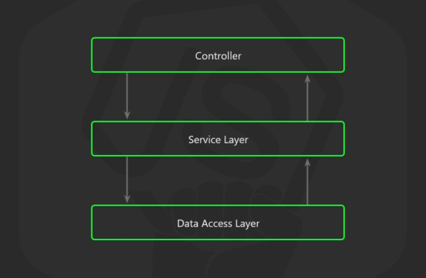
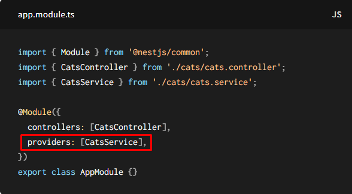
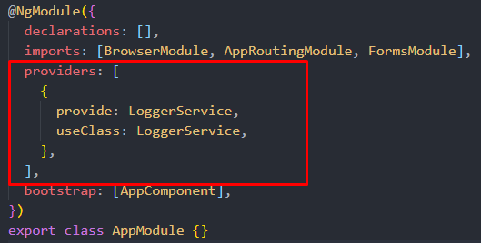

# Starter kit express

Я думаю, вы все согласны с тем, что когда мы пишем
приложение на экспресс она через короткое время
становится довольно таки трудно читабельным,
сложно тестируемым и сложно расширяемым.

Одна из основных проблем, возникающих при работе
с экспрессом это то, что контроллеры содержат бизнес-логику и рабата с базами данных, а также с другими сущностями, не принадлежащими контроллерам.

Вы можете поспорить и сказать, что в express
есть генератор (cli) благодаря этому генератору можно создать скелет приложения.

И вы отчасти будете правы, потому что экспресс имеет генератор
который генерирует нам приложения.

C помощью генератора получаем скелет приложения
но это все еще не решает основных проблем, которые
возникают при работе с экспрессом (разбиение кода на слои)
нигде нет архитектуры, описанной в каком месте хранить бизнес-логику или где именно работать с базой данных.

После генерации приложения мы получаем трудное для тестирования, расширения и чтения приложение. Кроме того, ваше приложение будет полностью привязано к express, и если в будущем вы захотите поменять фрейворк, вам придется переписать весь проект.

Представьте, если бы у вас сразу появился проект
с готовой архитектурой, где все разбито на слои
и каждый слой не зависит друг от друга, где контроллеры, бизнес-логика и базы данных разделены, и все разделено на модули.

И именно это я предлагаю вам.

## Вот что вы получите из коробки.

Ваша бизнес-логика не будет зависеть от фреймворка, она не будет зависеть от базы данных или от транспортного уровня (http, ws ...)

вы можете переключиться с REST FULL API в любое время в JSON API или что-то еще, для этого вам нужно будет изменить метод одного класса и все, и никакие другие части вашего приложения не будут изменены.

То же самое и с базой данных.
Вы не будете привязаны к конкретной базе данных, вы сможете легко и быстро переключаться по базам данных.

Вы можете изменить фреймворк за короткое время (в зависимости от написанного вами приложения), потому что в моей архитектуре фреймворк играет роль транспортного уровня.

Также у вас будет несколько базовых сервисов из коробки, которые сильно помогут вам при разработке приложения, а также полноценная конфигурация eslint, prettier, pre-commit, typescript.

# Из чего состоит это приложение ?

1. трехслойная архитектура

2. шаблон проектирование inversion of control в реализации dependency injection а также контейнер для зависимостей inversion of control container.

3. Шаблон проектирование repository (для разделение БД от бизнес логики)

4. Express.js и inversify-express-utils

5. TypeScript

## Трехслойная архитектура

Идея состоит в том, чтобы использовать принцип разделения ответственности, используя эту архитектуру, мы получаем три уровня.

1. Маршрутизатор, этот слой будет работать с http, ws... а также с express.

2. Сервис, ваша бизнес-логика живет в сервисе.Сам сервис - это класс, который следует принципам SOLID. На этом уровне не должно существовать какой-либо формы «SQL-запроса». В сервисах в 99% случаев не должно попадать объект req, res.
   Сервисы ничего не должны знать об транспортном уровне http,ws.

3. Слой данных, в этом слое хранится работа с базой данных.



## IOC, DI, IOCC

Если вы когда-либо писали на angular или nest.js, то вы уже знакомы с IOC, DI, IOCC.

Nest.js



Angular



Мы будем использовать inversify, который реализует шаблон проектирования IOC в виде DI, а также дает нам IOCC.

Если по какой-то причине вы до сих пор не знаете IOC, DI, IOCC
внизу есть ссылки на видео, в котором объясняется, что такое шаблон проектирования IOC и в виде DI, а также контейнер для зависимостей.

Илья Климов senior front-end engineer из Gitlub.

1. https://youtu.be/ETyltCwtQHs?list=PLvTBThJr861xKTf1x6P49MwN6yoN4v69k
2. https://youtu.be/RwLWYB9C2Tc?list=PLvTBThJr861xKTf1x6P49MwN6yoN4v69k
3. https://youtu.be/0IqU_13tMcc?list=PLvTBThJr861xKTf1x6P49MwN6yoN4v69k
4. https://youtu.be/icbryEgQPxk?list=PLvTBThJr861xKTf1x6P49MwN6yoN4v69k
5. https://youtu.be/pV-YKZEqsQ4?list=PLvTBThJr861xKTf1x6P49MwN6yoN4v69k

Андрей Мелихов senior backend engineer из Яндекс

1. https://youtu.be/3NgWwzwDeTQ
2. https://youtu.be/u6gAVCEJjQ4

## Шаблон проектирование repository

Суть данного шаблона проектирование состоит в том, чтобы не работать напрямую с БД, а работать через интерфейсы (более подробно можете почитать в википедии)

## Express.js и inversify-express-utils

inversify-express-utils - это библиотека, которая обертывает Express и позволяет нам использовать Express более удобным способом.

```ts
import * as express from 'express';
import {
  interfaces,
  controller,
  httpGet,
  httpPost,
  httpDelete,
  request,
  queryParam,
  response,
  requestParam,
} from 'inversify-express-utils';
import { injectable, inject } from 'inversify';

@controller('/foo')
export class FooController implements interfaces.Controller {
  constructor(@inject('FooService') private fooService: FooService) {}

  @httpGet('/')
  private index(
    req: express.Request,
    res: express.Response,
    next: express.NextFunction,
  ): string {
    return this.fooService.get(req.query.id);
  }

  @httpGet('/')
  private list(
    @queryParam('start') start: number,
    @queryParam('count') count: number,
  ): string {
    return this.fooService.get(start, count);
  }

  @httpPost('/')
  private async create(
    @request() req: express.Request,
    @response() res: express.Response,
  ) {
    try {
      await this.fooService.create(req.body);
      res.sendStatus(201);
    } catch (err) {
      res.status(400).json({ error: err.message });
    }
  }

  @httpDelete('/:id')
  private delete(
    @requestParam('id') id: string,
    @response() res: express.Response,
  ): Promise<void> {
    return this.fooService
      .delete(id)
      .then(() => res.sendStatus(204))
      .catch((err: Error) => {
        res.status(400).json({ error: err.message });
      });
  }
}
```

## TypeScript

Давайте будем реалистами, писать код на не типизированных языках программирования в 2021 году довольно проблематично, особенно если мы собираемся использовать ООП.

# Файловая структура проекта

| Имя              | Описание                                                                                                                                    |
| ---------------- | ------------------------------------------------------------------------------------------------------------------------------------------- |
| **node_modules** | Содержит установленные модели из npm                                                                                                        |
| **dist**         | Содержит компилированный код проекта.                                                                                                       |
| **src**          | Содержит не компилированные исходники проекта                                                                                               |
| .editorconfig    | Конфигурации и набор расширений для многих редакторов кода и IDE.                                                                           |
| .eslintignore    | Настройка параметров для eslint, путей, которые будут исключены из линтинга (т.е. игнорируются и линтер на них не влияет)                   |
| .eslintrc        | Конфигурация настроек для ESLint, определяющая стиль кодирования.                                                                           |
| .gitignore       | Не отслеживайте изменения в файлах с помощью git                                                                                            |
| .prettierrc      | Конфигурационный файл prettier                                                                                                              |
| package.json     | Файл, содержащий зависимости npm                                                                                                            |
| tsconfig.json    | Файл конфигурации для TypeScript                                                                                                            |
| yarn.lock        | Yarn нужна точная версия для каждой установленной зависимости. Для этого Yarn использует файл yarn.lock в корневом каталоге вашего проекта. |

## Папка src

| Имя            | Описание                                                                                       |
| -------------- | ---------------------------------------------------------------------------------------------- |
| **container**  | Именно внутри этой папки находится контейнер зависимостей приложение                           |
| **middleware** | Содержит ППО для express                                                                       |
| **services**   | Содержит сервисы которые не являются частью какого либо модуля и выполняют ровно одно действие |
| **utils**      | Содержит утилитарные функции                                                                   |
| **enums**      | Содержит enums                                                                                 |
| main.ts        | Является основной точкой входа для приложение                                                  |

## Папка container

| Имя                 | Описание                                                           |
| ------------------- | ------------------------------------------------------------------ |
| interfaces.ts       | Файл содержит интерфейсы сущностей которые будут inject-тироваться |
| tokens.ts           | Содержит токены благодаря которым будет inject-тироваться сущности |
| inversify.config.ts | В этом файле настраивается контейнер зависимости приложение        |

## Папка services

Любой сервис состоит из трех частей

1. name.interfaces.ts - В этом файле находится интерфейсы сервиса
2. name.service.ts - В этом файле находится логика сервиса
3. name.service.spec.ts - В этом файле находится тесты проверяющие логику сервиса

| Имя сервиса                                                                                                                                                            | Короткое описание сервиса, посмотрите сам сервис чтобы получить больше информации                                                                                                          |
| ---------------------------------------------------------------------------------------------------------------------------------------------------------------------- | ------------------------------------------------------------------------------------------------------------------------------------------------------------------------------------------ |
| **config**                                                                                                                                                             | Предоставляет класс, у этого класса есть поля get, с помощью которого вы можете получить файл конфигурации                                                                                 |
| **debug**                                                                                                                                                              | Является оберткой над модулем [debug](https://github.com/visionmedia/debug).                                                                                                               |
| **generate-token**                                                                                                                                                     | Является оберткой над модулем [jsonwebtoken](https://github.com/auth0/node-jsonwebtoken)                                                                                                   |
| **logger**                                                                                                                                                             | Является оберткой над модулем [winston](https://github.com/winstonjs/winston), благодаря этому логгеру вы можете сохранять ошибки, информацию или что-либо еще в базе данных               |
| **mail**                                                                                                                                                               | Является оберткой над модулем [nodemailer](https://github.com/nodemailer/nodemailer), благодаря данному сервису вы можете отправлять электронные письма сущности                           |
| **mongoose-connection**                                                                                                                                                | Благодаря этому сервису вы можете подключиться к mongodb через mongoose                                                                                                                    |
| **oauth**                                                                                                                                                              | Содержит методы для работы с vk, google и github, в дальнейшем вы можете без проблем добавлять другие социальные сети                                                                      |
| **response**                                                                                                                                                           | Именно эта служба будет определять, в каком формате должны поступать данные из служб, ресурсов, а также в каком формате данные должны быть отправлены клиенту по умолчанию "REST FULL API" |
| **validation**                                                                                                                                                         |
| Является оберткой над модулем [joi](https://github.com/sideway/joi), благодаря этой службе вы можете проверять объект, строки, массивы и т. д. с помощью схем.сущности |

Папка app: содержит модули вашего приложение.

Любой модуль состоит из шести частей

1. name.interfaces.ts - В этом файле находится интерфейсы модуля
2. name.service.ts - В этом файле находится логика модуля
3. name.controller.ts - В этом файле находится обработка маршрутов для модуля
4. name.controller.spec.ts - В этом файле находится тесты для маршрутов модуля
5. папка name-resource содержит ресурсы, в данном папке находится файл index.ts который возвращает как минимум один класс который реализует интерфейс ресурса модуля.
6. name.module.ts этот файл экспортирует все выше перечисленные сущности

Давайте разберемся как работает аутентификация, авторизация, идентификация, подтверждение email, восстановление пароля через email,
access tokens + refresh token + device id в контексте модуля auth.
